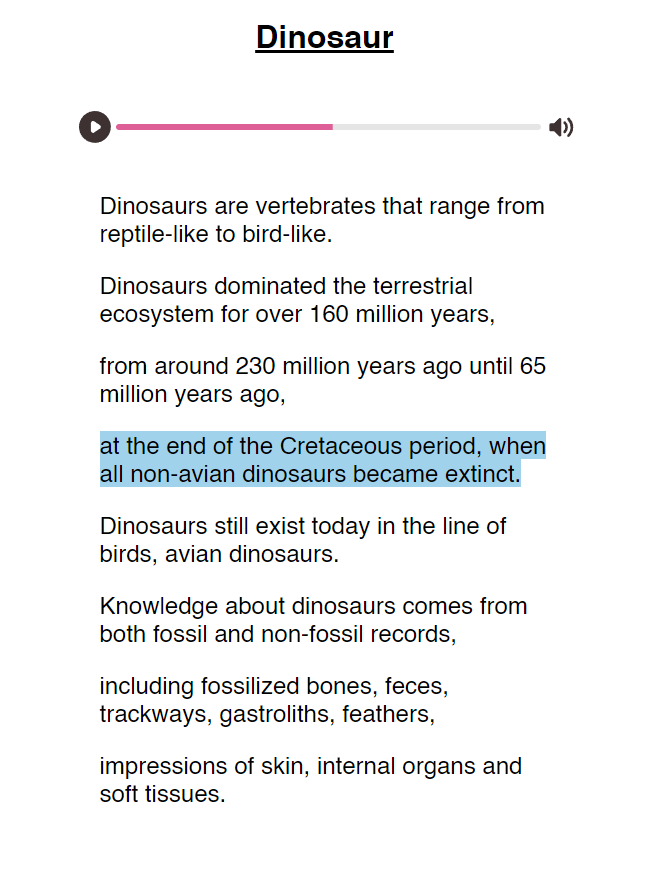

# A quick tool that I made to generate HTML content synced to audio

I was working on a site that required the highlighting of words to be synced to the audio that was being read.
This is an idea that I had to use OpenAI's Whisper to generate the paragraph text and timings.
The python script also outputs the HTML content which can be pasted into a template file.

It's not perfect but I enjoyed the simplicity of the idea.

## An example is given in `DinoEx`

The program outputs spans enclosed in paragraphs. Each span has the start time of the audio in the data-time attribute. The client Javascript finds the span with the greatest time less than the current playback time.

Wikipedia Dino transcription from [here](https://en.wikipedia.org/wiki/File:Dinosaur.ogg)
